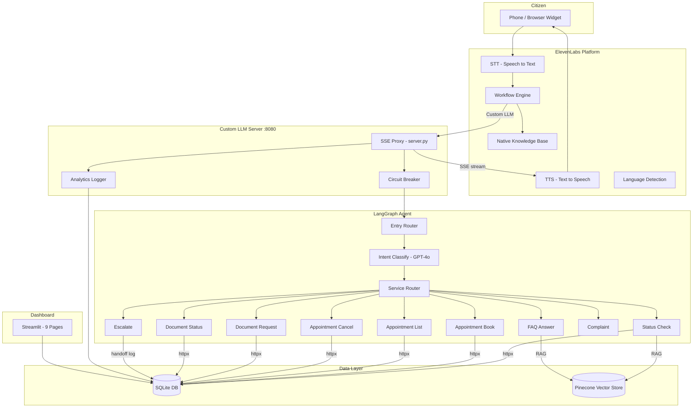
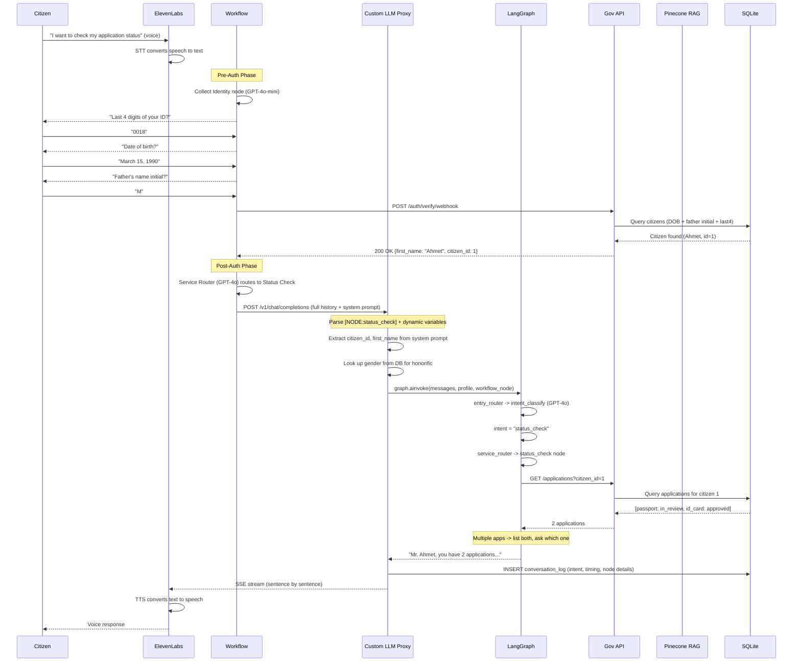
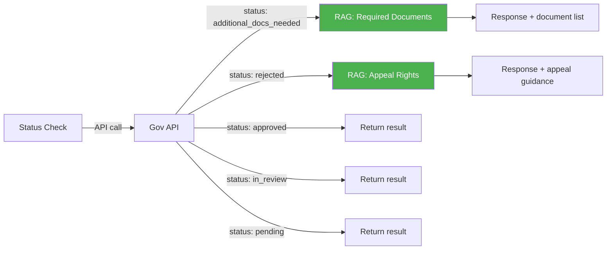
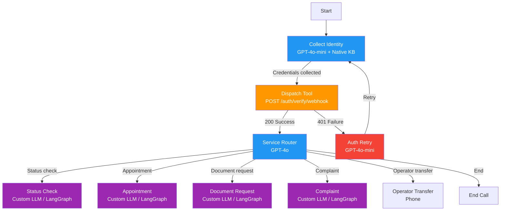
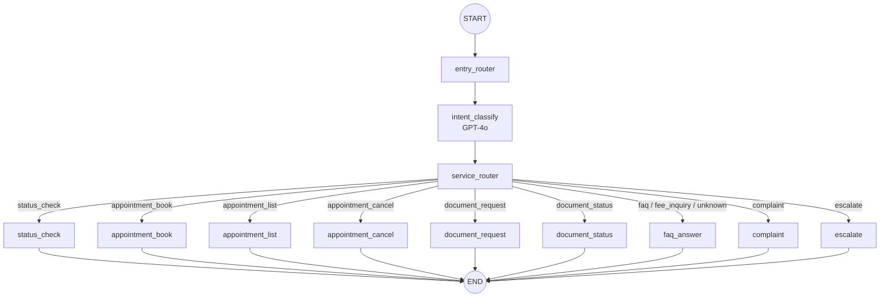
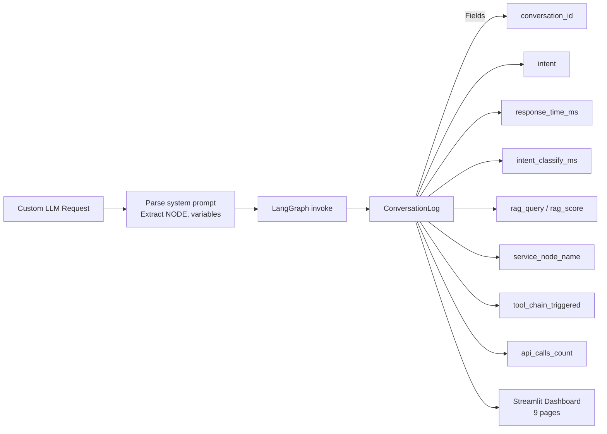
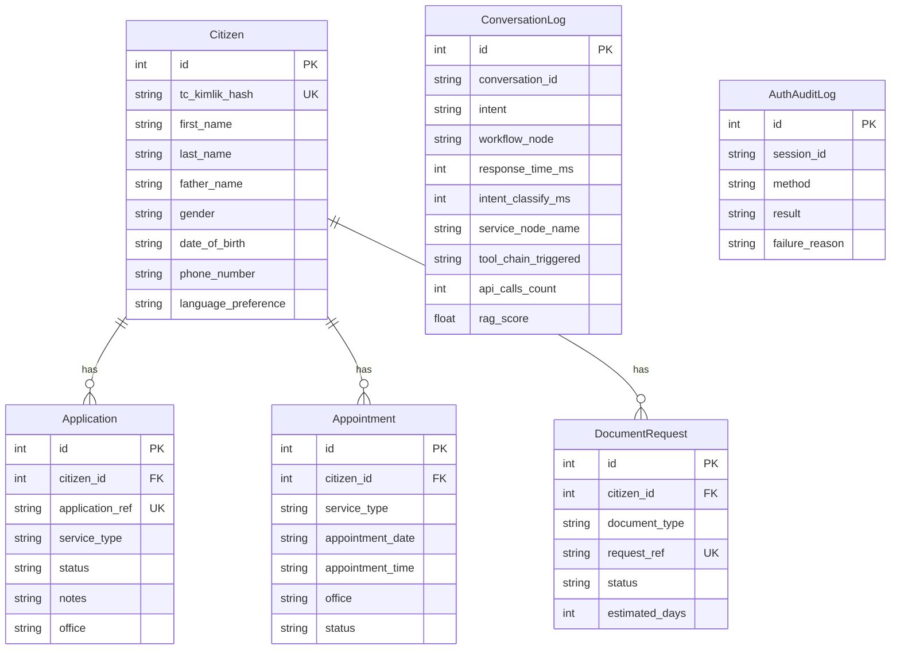

# Architecture

Detailed system design for the Government Citizen Services Voice Agent.

## System Overview

The system consists of four layers: Voice (ElevenLabs), Intelligence (LangGraph), Backend (FastAPI + SQLite), and Analytics (Streamlit).

## Request Lifecycle

What happens when a citizen says "I want to check my application status":

## Deterministic Tool Chaining

LangGraph's core differentiator — automatic secondary actions based on API results:

ElevenLabs native agents can't guarantee this: "if status API returned X, then automatically query knowledge base for Y." This requires programmatic control flow, which is exactly what LangGraph provides.

## ElevenLabs Workflow

The visual routing layer that handles authentication and high-level service selection:

**Key insight:** Workflow handles deterministic routing (auth yes/no). LangGraph handles intelligent routing (which service, tool chaining, RAG).

## LangGraph Node Graph

## Analytics Pipeline

Every Custom LLM request is logged to `conversation_logs` table:

## Database Schema

